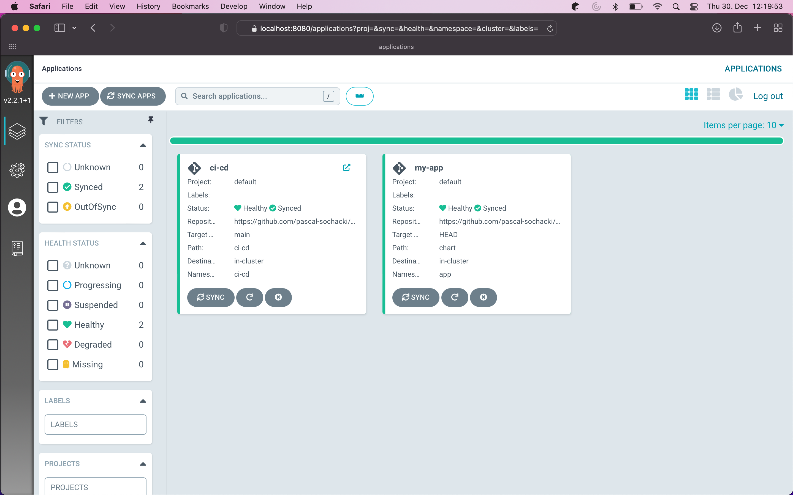

# Deploy a GitOps CI/CD implementation

Hey, in this guide we will deploy a GitOps CI/CD implementation, using Argocd, Terraform, Tekton and Helm. The aim is to
deploy a simple application each time a new commit is pushed to the repository.


### Prerequisites

kubectl 

helm 

terraform 

tekton

## Create a Kubernetes cluster

First, we will create a Kubernetes cluster in DigitalOcean. My goto is to use Terraform for this. First, we need to
authenticate with DigitalOcean. This could be
done [multiple ways](https://registry.terraform.io/providers/digitalocean/digitalocean/latest/docs), but I will use an
environment variable(`DIGITALOCEAN_TOKEN`). To retrieve a token, go
to [DigitalOcean](https://cloud.digitalocean.com/account/api/tokens) and create a new token. Now export the token to an
environment variable.

```
export DIGITALOCEAN_TOKEN=<your token>
```

With the token in hand, we can run

```
cd terraform
terraform init
terraform apply
```

This will create a Kubernetes cluster in DigitalOcean. The `main.tf` file contains the following:

```
resource "digitalocean_kubernetes_cluster" "main" {
  name    = "kubernetes-cluster"
  region  = "fra1"
  version = "1.21.5-do.0"
  node_pool {
    name       = "worker-pool"
    size       = "s-2vcpu-2gb"
    node_count = 2
  }
}
```

We can see i created a cluster named `kubernetes-cluster` in the `fra1` region. The cluster contains a `worker-pool`
node pool with 2 nodes. This could take a while, so we will wait for the cluster to be ready. In the meantime, we can
configure the `kubectl` context. We need to download the configuration file from the cluster
from [DigitalOcean](https://cloud.digitalocean.com/kubernetes/clusters). After downloading the file, we can set the
context.

```
export KUBECONFIG=<path to the downloaded file>
```

After about 4-5 minutes, we can run `kubectl get nodes` and see the nodes. If everything is working, we should see the
following:

```
NAME                STATUS   ROLES    AGE   VERSION
worker-pool-u6f28   Ready    <none>   31h   v1.21.5
worker-pool-u6f2u   Ready    <none>   31h   v1.21.5
```

Congratulations, you have created a Kubernetes cluster in DigitalOcean.

## Configure the Cluster to run our needed services

We will install multiple services in the cluster using Helm.

1) Argocd: This will allow us to use the principles of GitOps to manage the cluster.
2) ingress-nginx: This will allow us to access the application from the outside.
3) external-dns: This will allow us to configure the DNS records for the application. We later want to receive a Webhook
   from GitHub to deploy the application. This is why we need to configure the external-dns service.

The Helm chart for these services is available in the infra folder. For external-dns there is an additional file
necessary, which contains a DigitalOcean Token (which i will not share :D ).  
The same Token can be used as i have done in the previous step. The structure of the files is as follows:

```
external-dns:
  provider: digitalocean

  digitalocean:
    apiToken: <YourToken>

  interval: "1m"

  policy: sync

  domainFilters: [ '<YourDomain>' ]

```

Just copy the file and change it accordingly. After this we can install the services
using `helm install infra infra -f <YOUR_FILENAME>`.

#### Additional links:

1) [How To Automatically Manage DNS Records From DigitalOcean Kubernetes Using ExternalDNS](https://www.digitalocean.com/community/tutorials/how-to-automatically-manage-dns-records-from-digitalocean-kubernetes-using-externaldns)
2) [How To Set Up an Nginx Ingress on DigitalOcean Kubernetes Using Helm](https://www.digitalocean.com/community/tutorials/how-to-set-up-an-nginx-ingress-on-digitalocean-kubernetes-using-helm)

After this we will install tekton. I didn't find a helm chart for tekton, so i will use the offical install guide.
Basically, we execute the following command:

```
kubectl apply -f https://storage.googleapis.com/tekton-releases/operator/latest/release.yaml
kubectl apply -f https://raw.githubusercontent.com/tektoncd/operator/main/config/crs/kubernetes/config/all/operator_v1alpha1_config_cr.yaml
```

#### Additional links:

1) [https://tekton.dev/docs/pipelines/install/](Installing Tekton Pipelines)

## Creating ArgoCD Applications

In this step, we will create two ArgoCD application. One for our Pipeline Resources and the other for the Application.
ArgoCD is an application that watches for changes in the Git repository and automatically deploys the manifests. So both
Applications (in the argocd folder) point to two different repositories. One were
our [Application](https://github.com/pascal-sochacki/kubernetes-challenge-digital-ocean-app) and the other one is
the [Pipeline Resources](https://github.com/pascal-sochacki/kubernetes-challenge-digital-ocean).

```
apiVersion: argoproj.io/v1alpha1
kind: Application
metadata:
  name: my-app
spec:
  ...
  source:
    path: chart
    repoURL: 'https://github.com/pascal-sochacki/kubernetes-challenge-digital-ocean-app'
    targetRevision: HEAD
    helm:
      valueFiles:
        - values.yaml
  project: default
  ...
```

```
apiVersion: argoproj.io/v1alpha1
kind: Application
metadata:
  name: ci-cd
spec:
  ...
  source:
    path: ci-cd
    repoURL: 'https://github.com/pascal-sochacki/kubernetes-challenge-digital-ocean'
    targetRevision: main
  project: default
  ...
```

Also there is a additional file (`defaultProject.yaml`) in the Argocd folder, which contains the configuration for the ArgoCD Profile.
I encoutered a problem with the default ArgoCD profile, so I will do some modifications to the profile.
The problem was that ArgoCD deleted my PipelineRuns, so we ignore some "dynamic" resources, like PipelineRuns and TaskRuns.
I encourage you to create two repositories and replace my repositories with your own.
After this you can easily deploy the Argocd applications using 
```
kubectl apply -f argocd
```
If you want to see the ArgoCD application, you can use port-forward to see the application.
Just run the following command:
```
kubectl port-forward svc/infra-argocd-server 8080:80
```
Now you can access the ArgoCD Dashboard. 
The default username is `admin` and the default password is a little tricky.
We need to use the `kubectl` command to get the password.
```
kubectl get secrets argocd-initial-admin-secret -o jsonpath={.data.password} | base64 -d | pbcopy
```
The password is now in the clipboard. Paste it in the browser and click login.
You should see the ArgoCD Dashboard and hopefully our two Applications.



So your Pipeline Resources and Application are now deployed.
If we are now making changes in our Pipeline Resources or App and push them to the repository,
ArgoCD will automatically deploy the changes.

#### Additional links:

1) [ArgoCD Documentation](https://argo-cd.readthedocs.io/en/stable/)

## Creating Tekton Pipeline

Tekton is a native Kubernetes pipeline system.
There are some Objects that together make up a Pipeline.
First we have a Task, which executes a steps (see `ci-cd/build-task.yaml`).
This Task builds a Docker image using a kaniko image. ([kaniko github](https://github.com/GoogleContainerTools/kaniko)).
In a Task we can define params and resources.
Params can be used to pass values to the Task.
Resources are used to define the input and output of the Task.
Resources can be image registries and git repositories.
These resources need to be defined and applied to the Cluster.
Argocd should already deployed the resources.
The definition of the image registry can be found in `ci-cd/image-registry.yaml` and the git repository in `ci-cd/git-repository.yaml`.
Multiple Tasks can be defined in a Pipeline (see `ci-cd/pipeline.yaml`).
In addition to the build Task, we have a Task to determine the version of the image.
In the Task `find-mvn-version` we use the `mvn` command to find the version of the project.
See more about the task in the file `cd/find-mvn-version.yaml`.
In order to allow the Pipeline to run, we also need to define some Secrets.
The secret is used to allow the Pipeline to push the image to the registry.
As a registry we use the [DigitalOcean Registry](https://cloud.digitalocean.com/registry).
So you need to create a secret in the Cluster, which contains the username and password for the registry.
The structure of the secret is:
```
apiVersion: v1
kind: Secret
metadata:
  name: registry-credentials
  namespace: ci-cd
  annotations:
    tekton.dev/docker-0: registry.digitalocean.com
type: kubernetes.io/basic-auth
stringData:
  username: "<YourToken>"
  password: "<YourToken>"
```
Again you can use the same Token for the registry as in Step 1 and 2.
So with the secret we can now run the Pipeline.
```
tkn pipeline start my-pipeline -n ci-cd -s pipeline-sa --showlog
```
The Pipeline should now be running.
At the end of the Pipeline, the image should be pushed to the registry.


This is great! But it would be nice to have a better way to run the Pipeline.
We don't want to run the Pipeline to run by hand.

### Configuring Tekton to run the Pipeline
So we configure a EventListener to react on HTTP requests.
In Step 2 we installed ingress-nginx and external-dns which are used to configure the Listener.
It sounds difficult, but it is really easy.
See `ci-cd/EventListener.yaml` for more information.
We need just three things:
1) The EventListener
2) The TriggerTemplate
3) The Ingress

The Ingress is used to call the Service which is created by the EventListener.
The EventListener is uses the TriggerTemplate to run the Pipeline.
Because we installed external-dns, we don't need to configure the DNS records by hand.
If you have configured your DNS in digitalocean everything is created automatically.
To configure your DNS check the [digitalocean documentation](https://docs.digitalocean.com/products/networking/dns/).
This is how it looks like if everything is configured correctly:


external-dns creates DNS records and also a LoadBalancer with an IP address.
This URL can now be taken to GitHub to configure a webhook each time a push occurs.
This Setting can be found here: 


With everything configured the Pipeline should now be running each time a push occurs.
Let's see this in action in the video (`images/Webhook.mov`).

### Deploying the Application

Now we are able to build the application, but to deploy it we need to change the chart in the Application.
We already defined the Argocd Application in the Step 2.
A minor thing is left to do:
Enable the Cluster to access the image registry.
This could be done easily by going to the DigitalOcean dashboard and pressing a button, which will generate a dockerconfigjson in each Namespace in the selected Cluster.

So with everything working we can now build and deploy the application just by using git.

I hoped this was helpful, and you could follow along, if not, please let me know. 
This was my first time writing such a tutorial/guide.


